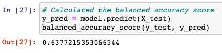

# Credit_Risk_Analysis

## Overview

Using an understanding of Python and machine learning, Jill wants to be able to apply machine learning to credit card risk. Jill wants to use imbalanced-learn and scikit-learn libraries to build and evaluate models based on a credit card dataset from LendingClub, a peer-to-peer lending services company. Six different models were used to resample the data. The methods used were:

- RandomOverSampler: over-samples the data
- SMOTE: over-samples the data
- ClusterCentroids: under-samples the data
- SMOTEENN: uses a combinatorial approach of over and under sampling
- BalancedRandomForestClassifier: Compares two machine learning models to reduce bias
- EasyEnsembleClassifier: Compares two machine learning models to reduce bias

Each model is then evaluated for performance and a recommendation is made whether or not a particular model should be used to effectively predict credit card risk. To do so, an accuracy score, confusion matrix and an imbalanced classification report are generated. By evaluating the precision, sensitivity and F1 score of each model, we can analyze how accurate each model is. 

## Results

### RandomOverSampler

- The balanced accuracy score for this model is about 65.0%
- The precision of predicting high_risk credit is only 1% with a sensitivity of 62%
- The F1 score is 2%
- Conversely, the precision for predicting low risk credit is 100% with a sensitivity of 68%

### SMOTE 

- The balanced accuracy score for this model is about 64.4%, slightly lower than the previous over-sampling model
- The precision of predicting high credit risk is still only 1% with a sensitivity of 63%
- The F1 score is 2%
- Conversely, the precision for predicting low risk credit is 100% with a sensitivity of 66%

### ClusterCentroids

- The balanced accuracy score for this model is about 51.6%
- The precision of predicting high credit risk is 1% with a sensitivity of 60%
- The F1 score is 1%
- Conversely, the precision for predicting low risk credit is 100% with a sensitivity of 43%

### SMOTEENN

- The balanced accuracy for this model is about 63.7%
- The precision of predicting high credit risk is 1% with a sensitivity of 71%
- The F1 score is 2%
- Conversely, the precision for predicting low risk credit is 100% with a sensitivity of 56%

### BalancedRandomForestClassifier

- The balanced accuracy score for this model is about 78.7%
- The precision of predicting high credit risk is 4% with a sensitivity of 67%
- The F1 score is 7%
- Conversely, the precision for predicting low risk credit is 100% with a sensitivity of 91%

### EasyEnsembleClassifier

- The balanced accuracy score for this model is about 92.5%
- The precision of predicting high credit risk is 7% with a sensitivity of 91%
- The F1 score is 14%
- Conversely, the precision for predicting low risk credit is 100% with a sensitivity of 94%

## Summary

All of the models do not detect high credit risk precisely. The best model was the EasyEnsembleClassifier given that it had the best accuracy and precision scores, yet, that model only predicted high risk credit 7% of the time and is highly sensitive. The consequences of using these models would result in a lot of false positives. In other words, many low risk credits would be falsely detected as high risk. However, if the models behaved inversely, then the banks would detect a lot of high risk credits as low risks which would put the bank in financial harm rather than just missing out on potentially good business ventures with low risk credit clients. 

Overall, if I were to recommend any of these models, it would be the EasyEnsembleClassifier as it has the highest accuracy score; however, using this model will still result in many false positive results. 